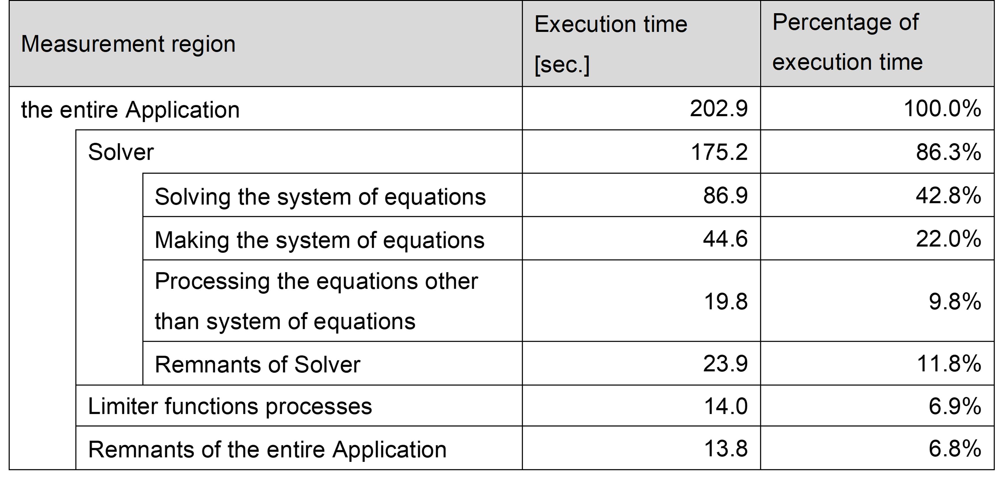
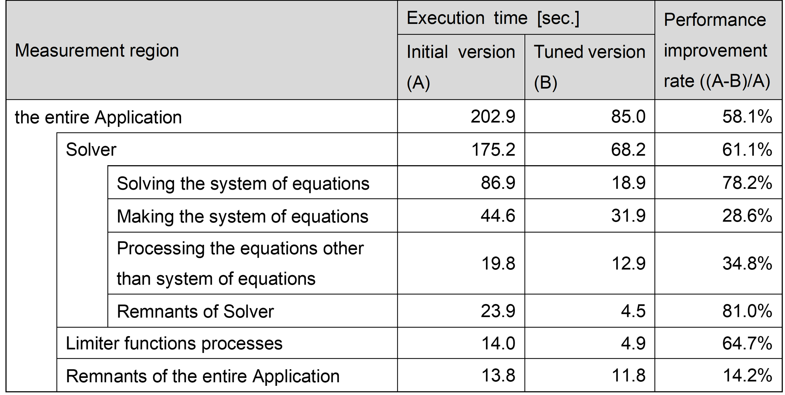
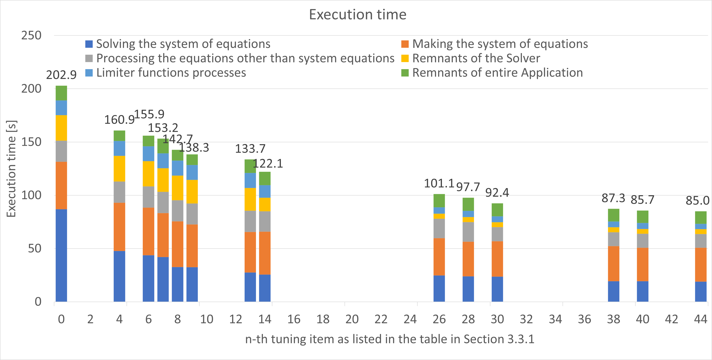
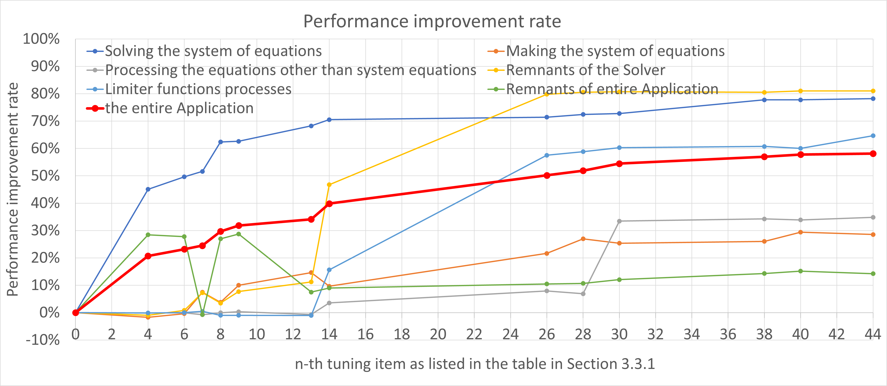

.. _Section3:

Tuning details and results
==========================

This chapter describes the details and results of the tuning performed
according to the procedure in Section 2.2 (:ref:`TuningMethods`).

.. _ElapsedTime:

Evaluation of the performance
-----------------------------

To compare with the performance after performing the tuning, the
execution time of the Application was measured before performing the
tuning. In this tuning work, the Application was divided into
measurement regions by reference to the log files that were output by
the Application, and the execution time of each measurement region was
also measured to make it easier to evaluate the effects of tuning. When
discussing the execution time of the Application in this document, both
the execution time of the entire Application and the execution time of
each measurement region must be described.

The measurement regions are composed of three portions: “Solver”,
“Limiter functions processes”, and “Remnants of the entire
Application”. Execution time of "Remnants of the entire Application" is
defined as execution time of the entire Application minus execution time
of "Solver" and "Limiter functions processes”.

“Solver” was further divided into four portions: “Solving the system of
equations”, “Making the system of equations”, “Processing the
equations other than system of equations”, and “Remnants of
Solver”. Execution time of "Remnants of Solver" is defined as
execution time of “Solver” minus execution time of other 3 portions.

The following table shows the execution time of initial version
and the execution time of each measurement region. As seen in the table,
“Solving the system of equations” is the largest measurement region, and
it is 43% of the entire Application.

.. _fippCost:

Cost of each function
---------------------

In order to focus on the target functions for tuning, the cost of each
function, which is proportional to the execution time of each function,
in the initial version was measured by sampling analysis using fipp. As
a result, in the initial version with the condition of the tuning, 1645
functions and their costs were output by fipp.

The following table represents the top ten functions by the result of
cost information by fipp as samples. Each column in the table represents
the following:

-  Function: the name of the function

-  Measurement region: the name of the measurement region that includes
   the function in the column “Function”

-  Cost: the cost of each function output by fipp

-  Percentage of the cost: the percentage of each function’s cost in
   relation to the total cost of the Application

-  Cumulative percentage of the cost: the cumulative percentage of the
   cost for each function from the first one

   
.. include:: ../table/table2.rst

As seen in the table , each cost of the top three functions were larger
than 10%, and the sum of their costs is more than 50% of the entire
Application.

The function with the highest cost was function “calc_function_1”, which
was in the measurement region “Solving the system of equations”, and the
percentage of the cost was 23% of the total. The functions
“function_of_MPI_1” and “function_of_MPI_2” followed “calc_function_1”.
However, they were related to wait time of an MPI communication, hence
it was not possible to tune these functions directly.

As seen in the cost of functions other than the top three functions, the
percentage of the cost of the fourth function was 3.54% of the total,
and the tenth function was only 1.54%. It means that the percentage of
the cost of most functions was less than a few percent in the initial
version.

Tuning of the Application
-------------------------

This section describes the tuning items and the Application performance
measured after performing the tuning.

.. _TuningList:

Tuning items
~~~~~~~~~~~~

The following table represents the tuning details and target functions
of all tuning items. Each column in the table represents the following:

-  Tuning #: item number for tuning items (Tuning items are assigned
   numbers in the order in which they were performed.)

-  Tuning outline: outline of each tuning item

-  Tuning method: the method for performing the tuning, such as
   specifying OCL(s) (Optimization Control Line) or changing compiler
   options

-  Classification of tuning: classification by reference to the
   “Programming Guide (Tuning)” that is posted on the user portal site

-  Target function: the name of target function of each tuning item

-  Measurement region: the name of the measurement region that includes
   the function in the column “Target function”

-  Section #: section number where the details of the tuning item are
   described

.. include:: ../table/table3.rst

This document describes ten of forty-four tuning items as samples in
Chapter 4 (:ref:`Section4`). The details of these ten tuning items are as follows:

-  **The tuning with local code changes**

   These are tuning items that improve performance without significant
   changes to the source code, such as specifying the OCL(s) in Section
   4.2.

   
   
    -  Section 4.1: :ref:`4p1` 
    -  Section 4.2: :ref:`4p2` 
    -  Section 4.3: :ref:`4p3`
    -  Section 4.4: :ref:`4p4`
    -  Section 4.7: :ref:`4p7`
    -  Section 4.8: :ref:`4p8`
    -  Section 4.9: :ref:`4p9`

-  **Advanced tuning for improving the performance of the A64FX
   processor**

   These are tuning items that take advantage of the characteristics of
   the A64FX processor to improve performance, such as using SVE ACLE,
   specific to Arm, in Section 4.5.
   
   
    - Section 4.5: :ref:`4p5`
    - Section 4.6: :ref:`4p6`

-  **Tuning to the functions which are called from many other
   functions**

   The targets of tuning, described in Section 4.10, are some functions
   that allocate or deallocate memory for two-dimensional arrays. While the
   cost of each function was low, these were called by many other
   functions. Therefore, tuning these functions was expected to improve the
   performance of the entire Application.

    - Section 4.10: :ref:`4p10`

.. _TuningResult:

Tuning results
~~~~~~~~~~~~~~

The following table represents the execution time of the initial version
and the tuned version (performed tuning items of #1 to #44), and the
performance improvement rate comparison between the initial version and
the tuned version. As seen in the table, the performance improvement
rate of the entire Application is 58%, in other words, the execution
time of the tuned version was less than half of the initial version,
thus the target performance was achieved.

In this tuning work, the performance of the Application was measured 13
times in the process of performing the 44 tuning items, and the
following each graph (Figure 1 or Figure 2) shows these results. In
Figure 1, the horizontal axis represents the n-th tuning item as listed
in the table in Section 3.3.1 (:ref:`TuningList`), and the vertical one represents the
execution time of the Application measured just after the n-th tuning.
Note that height of the vertical bar and the number at the top indicate
the execution time of the entire Application. In Figure 2, the
horizontal axis represents the same as Figure 1, and the vertical one
represents the performance improvement rate, comparing the initial
version and after performing the n-th tuning.

For example, the number “8”on the horizontal axis indicates that the
Application measured just after the 8th tuning item as listed in the
table in Section 3.3.1 (:ref:`TuningList`). Hence, the data at the vertical axis “8” in
Figure 1 shows the execution time of the Application after performing
the tuning items #1 to #8. Note that the data at the position of the
horizontal axis 0 shows the data of initial version.

Figure 1: The execution time of the entire Application measured just 
after performing the n-th tuning.

Figure 2: The performance improvement rate, comparing the initial
version and after performing the n-th tuning.

   

As seen in the Figure 2, the entire Application was improved by about
34% and the performance of the “Solving the system of equations“ was
improved by about 68% from the 1st to the 13th tuning item. The first 13
tuning items were targeted for the top eight highest cost functions, and
especially 7 of them were targeted for the function “calc_function_1”,
which was the function with highest cost in the initial version.

In Figure 2, the graph shows a steep increase of “the entire
Application” (about 34% to 40%) from the 13th to the 14th tuning item.
The 14th tuning item improved the load imbalance between processes by
changing execution parameters of the domain decomposition of the
Application, and it was performed according to the suggestion given by
the ISV who developed the Application.

Additionally, the performance of the entire Application further improved
by about 18% by performing the 15th to the 44th tuning item, which was
targeted for lower-cost (other than the top three functions in the table
in Section 3.2) functions. Therefore, each performance improvement rate
of the tuning item to the entire Application was smaller than those of
the 1st to the 14th tuning item.

Focusing on the performance improvement rate for each measurement region
in Figure 2, tuning items #1 to #13 contribute significantly to the
performance improvement of “Solving the system of equations”. Similarly,
#14 contributes to “Remnants of Solver”, #15 to #26
contribute to “Limiter functions processes”, and #28 to #30 contribute
to “Processing the equations other than system of equations”.

In summary, 44 tuning items were performed, which led to the reduction
of the execution time of the entire Application from 202.9 seconds to
85.0 seconds (about 2.4 times faster) and the achievement of the target
performance (reduction of the execution time to less than half). The
details are as follows:

-  40 items were targeted for the top 30 functions that account for about
   52% (except functions related to the MPI communications) of the
   entire Application.

-  2 items were targeted for the low-cost functions that were called from
   various parts of this Application (one of which was described in
   Section 4.10 (:ref:`4p10`)\).

-  1 item: improvement of load balance between processes

-  1 item: implementation of thread parallelization

.. admonition:: Column: For large-scale simulations at Fugaku

   The tuning items #14 and #31 are especially important to execute the
   large-scale simulations using hundreds of thousands of CPU cores, which
   are required by users.

      | #14: Changing the parameters of domain decomposition of input models

      In this tuning item, the parameters of decomposition were changed to
      improve the load balance between MPI processes. Improving the load
      balance between MPI processes leads to reduce the communication
      latency between MPI processes. Also, the impact on the latency will
      be getting larger as the number of processes increases. Therefore, it
      is important to balance the amount of operations performed by each
      process.
      
      

      | #31: Thread parallelization
      
      The initial version of the Application did not support thread
      parallelization. However, thread parallelism is crucial for executing
      the large-scale simulations using hundreds of thousands of CPU cores
      more efficiently. Therefore, thread parallelization was performed.
      This is the first time that thread parallelization has been performed
      on the Application. In this tuning item, thread parallelization was
      performed only for the functions “cal_function_1” and
      “make_function_7”, which do not include factors inhibiting thread
      parallelization such as data conflicts, were therefore easy to
      implement. The percentage of the cost of the two functions accounted
      for about 25% in the initial version.
      
      
      

   The execution conditions, such as the model and parallel number, in this
   tuning work are not large enough to evaluate the performance of
   large-scale simulations using hundreds of thousands of CPU cores.
   Therefore, after the 44 tuning items were performed, a simulation of the
   larger-scale model with about 800 million elements was carried out on
   Fugaku to evaluate the effect of the tuning. The simulation was executed
   using over 4000 compute nodes, with hybrid MPI-OpenMP parallelism (with
   4 threads). As a result, it completed with up to about 220,000 CPU
   cores, and also the speed-up was observed up to about 200,000 CPU cores.
   The execution of the much larger-scale simulations is expected by
   further improvements, such as thread parallelization of the other loops.
   
