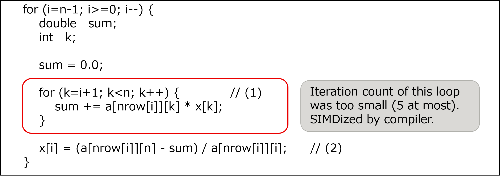
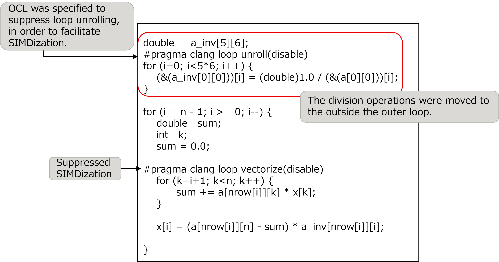

.. _4p1:

SIMDization of division operations and suppression of SIMDization for loops with small iteration counts
-------------------------------------------------------------------------------------------------------

Target for this tuning
~~~~~~~~~~~~~~~~~~~~~~

The target for tuning in this section is the function “calc_function_3”,
which is in the measurement region “Solving the system of equations”. In
the initial version of the Application, the cost of this function was
1.6% of that of the entire Application.

Analysis
~~~~~~~~

The following nested loop was selected as a target after the analysis of
the function “calc_function_3”. The key points of this source code are
as follows:

-  Only the inner loop (1) was SIMDized by the compiler. However, the
   SIMDization was not performed effectively because the iteration count
   of this loop was too small (5 at most).

-  Loop (1) included the operations of summing the calculation results
   due to the SIMDization.

-  The division operation in (2) in the outer loop was not SIMDized.

[Some lines from function “calc_function_3” before this tuning was
performed]

|image2|

Tuning
~~~~~~

The following tuning was performed.

-  In order to change the division operations to multiplication
   operations in this target loop, the division operations were moved to the
   outside of the outer loop to calculate 1/a[][] before the outer loop.
   Additionally, OCL was specified to suppress loop unrolling of this
   new loop, so that this loop could be SIMDized. To store 1/a[][] in
   this loop, an extra array a_inv[][] was added whose size must be 5 x
   6.

-  Another OCL was specified to suppress the SIMDization of the inner
   loop.

[Some lines from function “calc_function_3” after this tuning was
performed]

|image3|

.. _evaluation-of-the-performance-1:

Evaluation of the performance
~~~~~~~~~~~~~~~~~~~~~~~~~~~~~

To evaluate the effect of this tuning, cost information (output by fipp)
of the entire Application and target function before performing this
tuning was compared with that after performing this tuning.

The following table represents the cost measurement results by fipp.
This tuning reduced the cost of the function “calc_function_3” by 30%
and the entire Application cost by 1.4%.

[Cost measurement results by fipp]
   
.. include:: ../table/table5.rst

          

