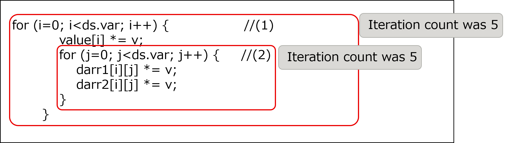
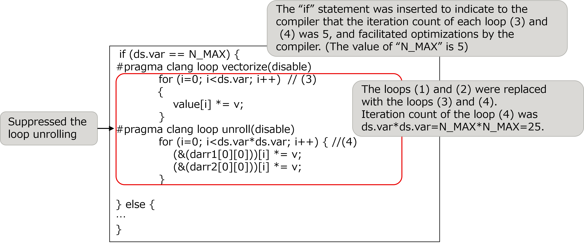

.. _4p3:

SIMDization by loop collapse
----------------------------

.. _target-for-this-tuning-2:

Target for this tuning
~~~~~~~~~~~~~~~~~~~~~~

The target for tuning in this section is the function “make_function_6”,
which is in the measurement region “Making the system of equations”.
In the initial version of the Application, the cost of this function was
1.2% of that of the entire Application.

.. _analysis-2:

Analysis
~~~~~~~~

The following nested loop was selected as a target after the analysis of
the function “make_function_6”. The key points of this source code are
as follows:

-  The loop (1) in the following source code was not SIMDized.

-  The iteration count of each loop (1) and (2) was 5 (constant with
   this model).

[Some lines from function “make_function_6” before this tuning was
performed]

|image6|

.. _tuning-2:

Tuning
~~~~~~

The following tuning was performed.

-  The nested loop was divided into two loops (3) and (4) as seen in the
   following source code, whose iteration count was 5 and 25
   respectively. The latter one was composed of the nested loop by “i”
   and “j”, but collapsed manually.

-  In order to facilitate the SIMDization, the OCL for suppressing loop
   unrolling was specified for the collapsed loop.

[Some lines from function “make_function_6” after this tuning was
performed]

|image7|

.. _evaluation-of-the-performance-3:

Evaluation of the performance
~~~~~~~~~~~~~~~~~~~~~~~~~~~~~

To evaluate the effect of this tuning, cost information (output by fipp)
of the entire Application and target function before performing this
tuning was compared with that after performing this tuning.

The following table represents the cost measurement results by fipp.
This tuning reduced the cost of the function “make_function_6” by 31.2%
and the entire Application cost by 2.1%.

[Cost measurement results by fipp]

.. include:: ../table/table7.rst

      

   

