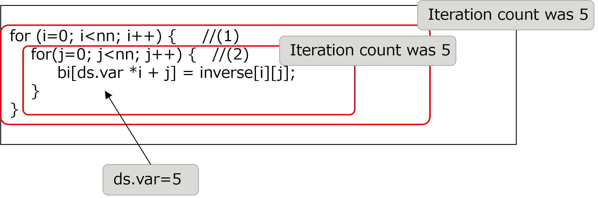
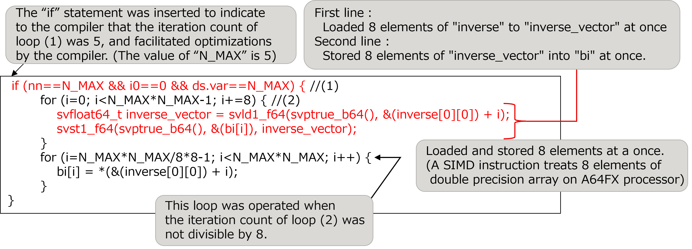
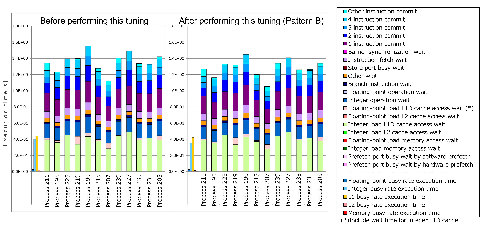

.. _4p5:

SIMDization by SVE ACLE
-----------------------

.. _target-for-this-tuning-4:

Target for this tuning
~~~~~~~~~~~~~~~~~~~~~~

The target for tuning in this section is the function “calc_function_4”,
which is in the measurement region “Solving the system of equations”. In
the initial version of the Application, the cost of this function was
1.0% of that of the entire Application.

.. _analysis-4:

Analysis
~~~~~~~~

The following nested loop was selected as a target after the analysis of
the function “calc_function_4”. The key points of this source code are
as follows:

-  The loop (1) in the source code was not SIMDized.

-  The iteration count of each loop (1) and (2) was 5 (constant with
   this model).

-  Above the key points were same as those in Section 4.3 (:ref:`4p3`). Therefore, it
   was also expected to be improved by the loop collapse.

[Some lines from function “calc_function_4” before this tuning was
performed]

|image11|

.. _tuning-4:

Tuning
~~~~~~

Two types of tuning, Pattern A and Pattern B, were attempted as follows.

<Pattern A>

-  The nested loops were collapsed into a single loop as well as Section
   4.3 (:ref:`4p3`).

[Some lines from function “calc_function_4” after this tuning Pattern A
was performed]

|image12|

When compiled after performing this tuning, the optimization messages of
the compiler indicated that SIMDization was applied to this loop,
however the SVE instruction rate with this tuned code was 0.0%. It meant
that the loop above was not SIMDized despite the message. Therefore,
Pattern B was performed as follows.

<Pattern B>

-  SIMDization was performed by using built-in functions of SVE ACLE (Arm C
   Language Extensions for SVE: the method of specifying SVE
   instructions directly into a program).

[Some lines from function “calc_function_4” after this tuning Pattern B
was performed]

|image13|

.. _evaluation-of-the-performance-5:

Evaluation of the performance
~~~~~~~~~~~~~~~~~~~~~~~~~~~~~

To evaluate the effect of this tuning, “cycle accounting” (output by
fapp) in the loop (1) before performing this tuning was compared with
that after performing this tuning.

|image14|

As seen in the graphs above, the execution time of Process 199, which
has the longest execution time (the execution time depends on the
longest process) among the measurement results both before and after
performing this tuning, was reduced from 1.55 seconds to 1.45 seconds,
in other words, the performance was improved by about 6%.

Especially, the execution time of “2 instruction commit” was
significantly improved by this tuning. This improvement indicates
the effect of the reduction in the number of instructions due to the
SIMDization by tuning in this section.

   
.. |image12| image:: ../media/image12.png
   :scale: 25%

   