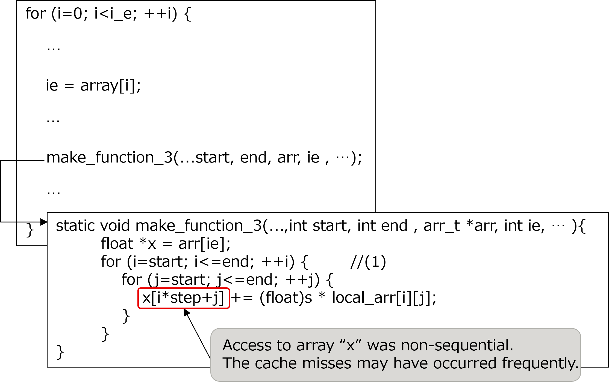
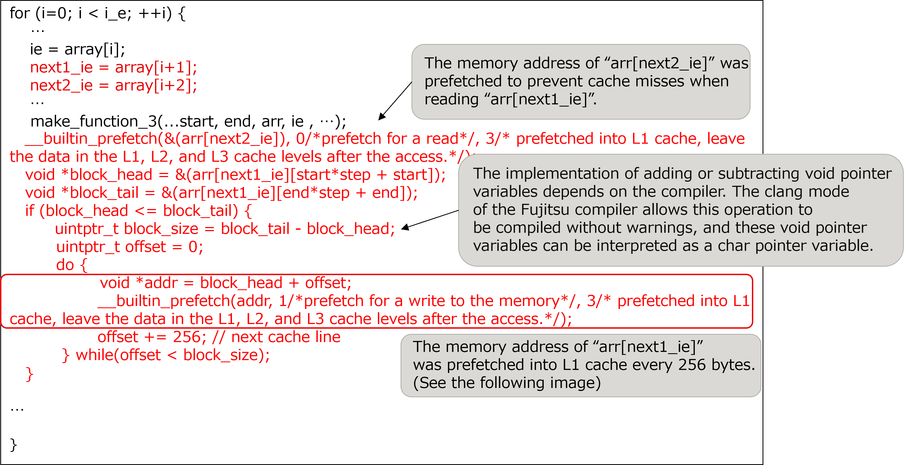
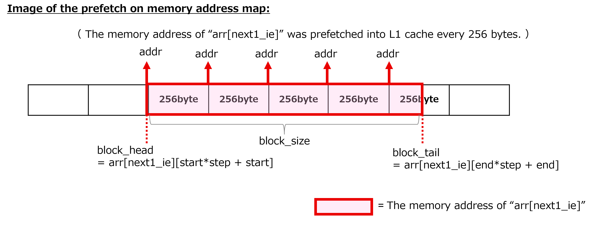
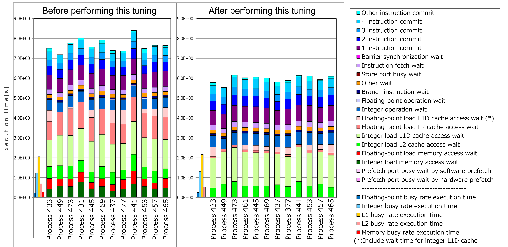

.. _4p6:

Built-in prefetch
-----------------

.. _target-for-this-tuning-5:

Target for this tuning
~~~~~~~~~~~~~~~~~~~~~~

The target for tuning in this section is the function “make_function_3”,
which is in the measurement region “Making the system of equations”. In
the initial version of the Application, the cost of this function was
1.7% of that of the entire Application.

For the functions “make_function_2” and “make_function_7” the same
tuning was also performed. The analysis and tuning points were same as
those for the function “make_function_3”. This section describes the
tuning for the function “make_function_3” as an example.

.. _analysis-5:

Analysis
~~~~~~~~

The following nested loop (1) was selected as a target after the
analysis of the function “make_function_3”. For discussion later, both
the function “make_function_3” and the caller of the function are shown
in the following figure. The key points of this source code are as
follows:

-  As seen in the results of fapp for the loop (1) in Section 4.6.4,
   cache access wait, such as “Floating-point load L2 cache access wait”
   event, occurred.

-  The array “x” in the function “make_function_3” accessed memory map
   non-sequentially, therefore cache misses may have occurred
   frequently.

[Some lines from function "make_function_3" and the caller of the
function before this tuning was performed]

|image15|

.. _tuning-5:

Tuning
~~~~~~

The following tuning was performed.

-  In order to improve the cache use efficiency of the function
   “make_function_3”, the built-in functions of prefetch were used. As a
   result of the analysis, these built-in functions were inserted in the
   caller of the function “make_function_3”. These built-in functions
   are one of the GNU C/C++ extensions supported by the compiler.

[Some lines from the caller of the function “make_function_3” after this
tuning was performed]

|image16|

|image17|

.. _evaluation-of-the-performance-6:

Evaluation of the performance
~~~~~~~~~~~~~~~~~~~~~~~~~~~~~

To evaluate the effect of this tuning, “cycle accounting” (output by
fapp) in the function “make_function_3” before performing this tuning
was compared with that after performing this tuning.

|image18|

As seen in the graphs above, the execution time of Process 441, which
has the longest execution time (the execution time depends on the
longest process) among the measurement results both before and after
performing this tuning, was reduced from 8.40 seconds to 6.15 seconds,
in other words, the performance was improved by about 27%.

Especially, the execution time of “Floating-point load L2 cache access
wait”, “Floating-point load memory access wait”, and “Integer load memory
access wait” was significantly improved by this tuning. This improvement 
indicates the effect of this tuning.

   

   