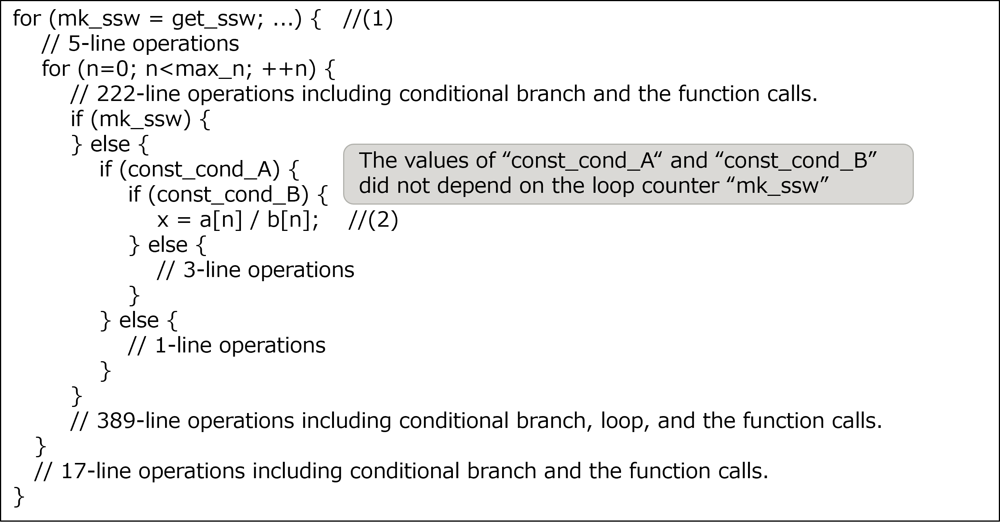
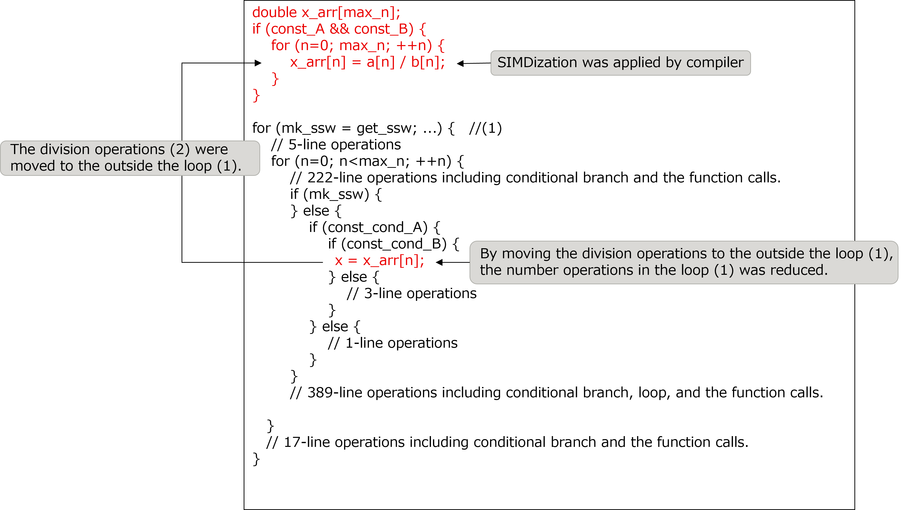

.. _4p7:

Moving division operations to outside of the loop, and applying SIMDization to the division operations
------------------------------------------------------------------------------------------------------

.. _target-for-this-tuning-6:

Target for this tuning
~~~~~~~~~~~~~~~~~~~~~~

The target for tuning in this section is the function “make_function_7”,
which is in the measurement region “Making the system of equations”. In
the initial version of the Application, the cost of this function was
1.2% of that of the entire Application.

.. _analysis-6:

Analysis
~~~~~~~~

The following nested loop was selected as a target after the analysis of
the function “make_function_7”. The key points of this source code are
as follows:

-  The loop (1) had many operations, such as the function calls,
   therefore the SIMDization couldn’t be applied to this loop.

-  The quotients of the division operations (2) did not depend on the
   loop counter “mk_ssw” used in the outer loop (1).

[Some lines from function "make_function_7" before this tuning was
performed]

|image19|

.. _tuning-6:

Tuning
~~~~~~

The following tuning was performed.

-  In order to facilitate the SIMDization of the division operations,
   the division operations (2) were moved to the outside of the loop
   (1).

[Some lines from function "make_function_7" after this tuning was
performed]

|image20|

The aim of this tuning was to apply the SIMDization to the division
operations, and thereby the number of instructions in the loop (1) was
also reduced.

.. _evaluation-of-the-performance-7:

Evaluation of the performance
~~~~~~~~~~~~~~~~~~~~~~~~~~~~~

To evaluate the effect of this tuning, cost information (output by fipp)
of the entire Application and target function before performing this
tuning was compared with that after performing this tuning.

The following table represents the cost measurement results by fipp.
This tuning reduced the cost of the entire Application cost by 0.7%.

[Cost measurement results by fipp]

.. include:: ../table/table8.rst

\* Note that this table represents the measurement results for executing
with 768 MPI processes.

   

   