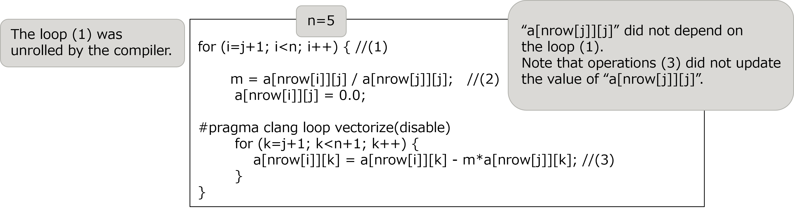
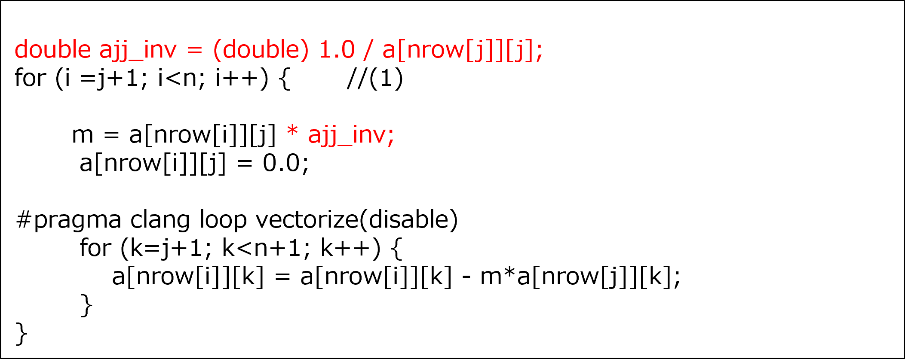
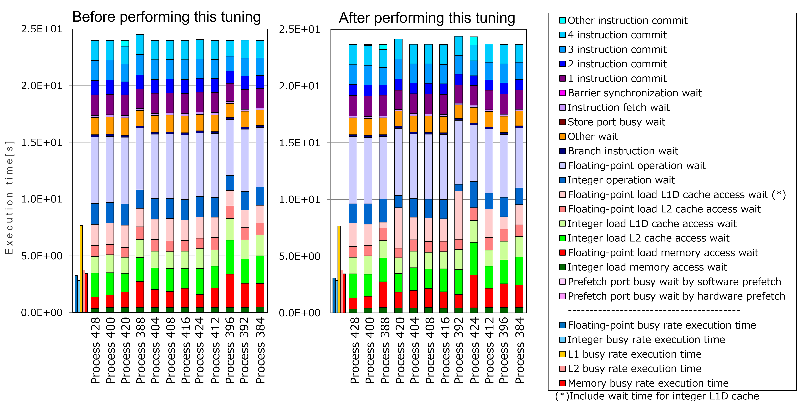

.. _4p8:

Moving invariant expressions to outside of the loop
---------------------------------------------------

.. _target-for-this-tuning-7:

Target for this tuning
~~~~~~~~~~~~~~~~~~~~~~

The target for tuning in this section is the function “calc_function_2”,
which is in the measurement region “Solving the system of equations”. In
the initial version of the Application, the cost of this function was
1.9% of that of the entire Application. This function was the second
highest cost functions in “Solving the system of equations” in the
initial version.

.. _analysis-7:

Analysis
~~~~~~~~

The following nested loop was selected as a target after the analysis of
the function “calc_function_2”. The key points of this source code are
as follows:

-  The loop (1) was unrolled successfully by the compiler.

-  The quotients of the division operations (2) did not depend on the
   counter variable of the loop (1). Therefore, it was possible to move
   the division operations (2) to the outside of the loop (1).

[Some lines from function "calc_function_2" before this tuning was
performed]

|image21|

.. _tuning-7:

Tuning
~~~~~~

The following tuning was performed.

-  In order to reduce the operational amount in the loop (1), the
   division operations, which did not depend on the loop counter “I”,
   were moved to the outside of the loop (1).

[Some lines from function "calc_function_2" after this tuning was
performed]

|image22|

.. _evaluation-of-the-performance-8:

Evaluation of the performance
~~~~~~~~~~~~~~~~~~~~~~~~~~~~~

To evaluate the effect of this tuning, “cycle accounting” (output by
fapp) in the measurement region “Solving the system of equations” before
performing this tuning was compared with that after performing this
tuning.

|image23|

As seen in the graphs above, the execution time measured before
performing this tuning (depends on the longest process, Process 388) was
24.48 seconds. On the other hand, the execution time measured after
performing this tuning (similarly, Process 392) was 24.38 seconds. This
means about 0.4% improvement. This indicates the effect of this tuning.

   

   