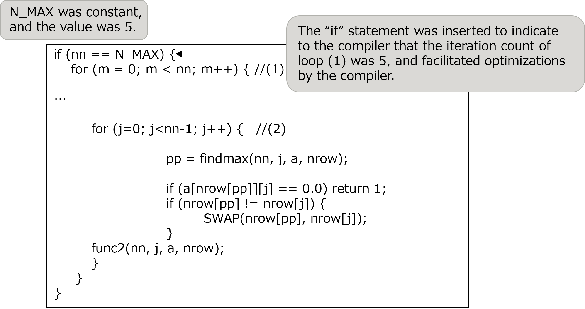
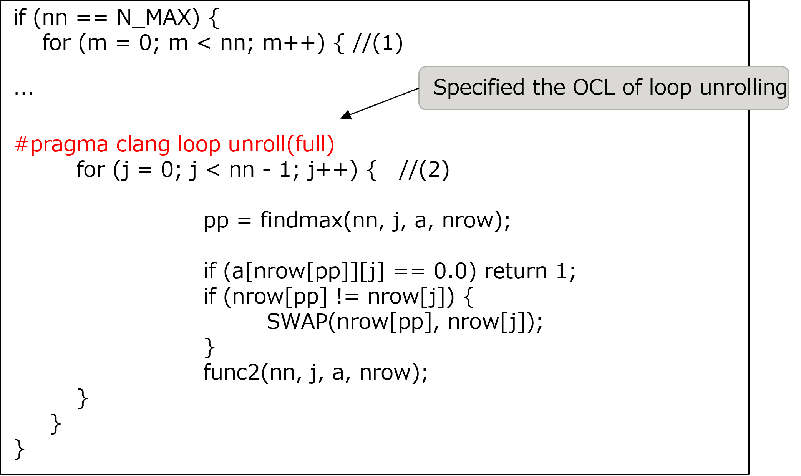
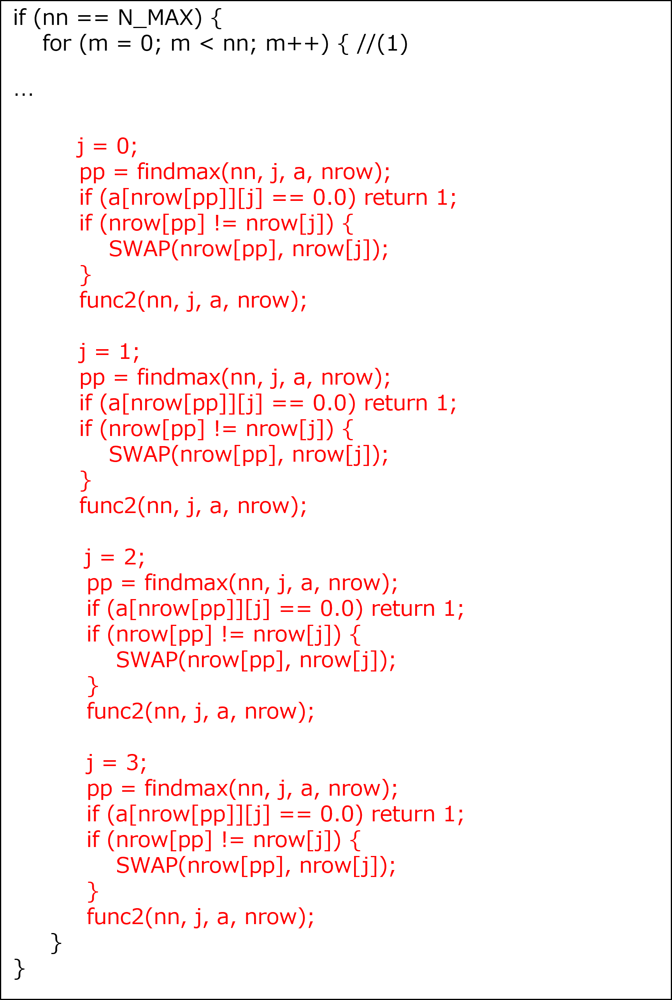
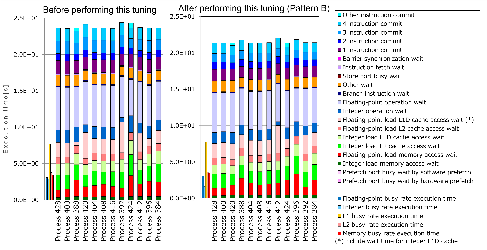

.. _4p9:

Loop unrolling manually instead of OCLs
---------------------------------------

.. _target-for-this-tuning-8:

Target for this tuning
~~~~~~~~~~~~~~~~~~~~~~

The target for tuning in this section is the function “calc_function_4”,
which is in the measurement region “Solving the system of equations”. In
the initial version of the Application, the cost of this function was
1.0% of that of the entire Application. This function was the fourth
highest cost function in "Solving the system of equations" in the
initial version

.. _analysis-8:

Analysis
~~~~~~~~

The following nested loop was selected as a target after the analysis of
the function “calc_function_4”. The key points of this source code are
as follows:

-  The "if” statement outside the loop (1), which was already inserted
   by another tuning item, indicated that the iteration count of loop
   (1) was 5 (constant with this model), and then the loop (1) was
   unrolled automatically by the compiler. On the other hand, the loop
   (2) was not unrolled by the compiler.

[Some lines from function "calc_function_4" before this tuning was
performed]

|image24|

.. _tuning-8:

Tuning
~~~~~~

Two types of tuning, Pattern A and Pattern B, were attempted as follows.

<Pattern A>

-  The OCL was specified to unroll the loop (2) for the purpose of
   improving instruction scheduling.

[Some lines from function "calc_function_4" after this tuning Pattern A
was performed]

|image25|

However, with the above optimization, the compiler could not unroll the
loop (2). Therefore, Pattern B was performed as follows.

<Pattern B>

-  The loop (2) was unrolled manually instead of OCL.

[Some lines from function "calc_function_4” after this tuning Pattern B
was performed]

|image26|

.. _evaluation-of-the-performance-9:

Evaluation of the performance
~~~~~~~~~~~~~~~~~~~~~~~~~~~~~

To evaluate the effect of this tuning, “cycle accounting” (output by
fapp) in the measurement region “Solving the system of equations” before
performing this tuning was compared with that after performing this
tuning.

|image27|

As seen in the graphs above, the execution time measured before
performing this tuning (depends on the longest process, Process 392) was
24.38 seconds. On the other hand, the execution time measured after
performing this tuning (similarly, Process 412) was 22.01 seconds. This
means about 10% improvement.

Especially, the execution time of Floating-point operation wait” was
improved by this tuning. This indicates improved scheduling by loop
unrolling.

   

   
   
   