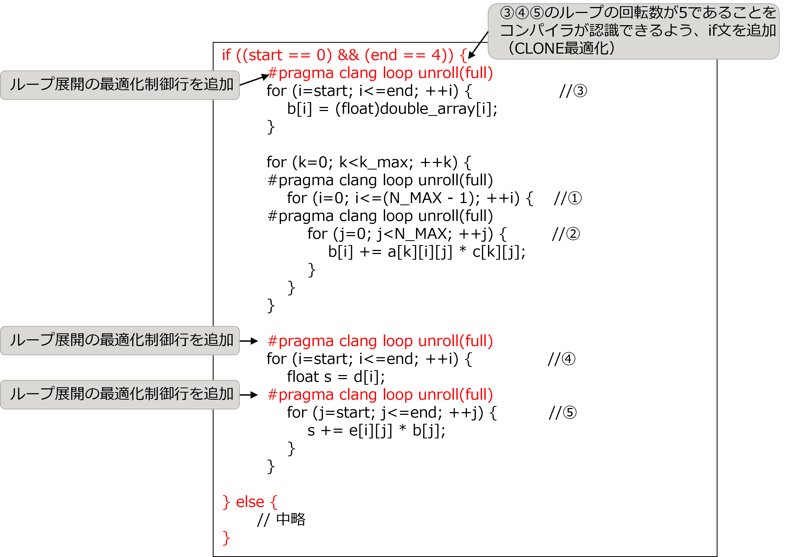

.. _4p2:

ループ展開によるload/store削減
------------------------------

.. _チューニング対象-1:

チューニング対象
~~~~~~~~~~~~~~~~

本節で対象とした calc_function_1 関数は、「システム方程式マトリクス計算」の計測区間に含まれ、チューニング実施前のアプリケーション全体の約23.3％のコストを占めている関数です。

.. _分析-1:

分析
~~~~

calc_function_1 関数を分析した結果、下記のループに着目しました。このループの特徴は以下の通りです。

-  ソースコード抜粋の①②のループは最適化制御行によりループ展開済みですが、③④⑤のループはループ展開されていません。

-  ③④⑤のループは5回転の定数回転ループです。ループ展開することで配列 b がレジスタに乗り、配列 b に対する load と store を削減できると考えられます。

[チューニング実施前の calc_function_1 関数のソースコード抜粋]

|image4|

.. _実施-1:

実施
~~~~

分析結果を踏まえて、以下のチューニングを実施しました。

-  最適化制御行を追加し、ソースコード抜粋の③④⑤のループをループ展開します。

-  if 文を追加し、③④⑤のループの回転数が5であることを明示する CLONE 最適化を実施します。

..

   ※なお、本アプリケーションへのチューニング実施時には利用できませんでしたが、tcsds-1.2.31 で CLONE 最適化と同じ最適化を行う最適化指示子（使用例：#pragma
   fj loop clone *var==n*\ ）が追加されました。この最適化指示子を使用することで、if文追加によるCLONE最適化と同じ効果が得られることが期待されます。

以下は、チューニング実施後のソースコードです。

[チューニング実施後の calc_function_1 関数のソースコード抜粋]

|image5|

.. _効果の検証-1:

効果の検証
~~~~~~~~~~

実施したチューニングの効果を、チューニング実施前後の基本プロファイラを用いて評価しました。下表はコストの計測結果です。
本節のチューニングにより calc_function_1 関数のコストが20.8％減少し、アプリケーション全体のコストが3.5%減少しました。

   
.. include:: ../table/table6.rst

   

   
   
   