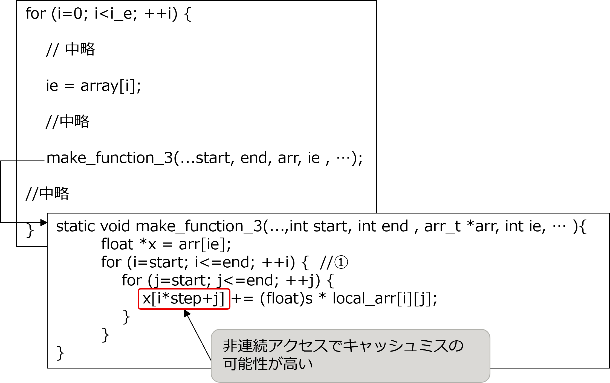
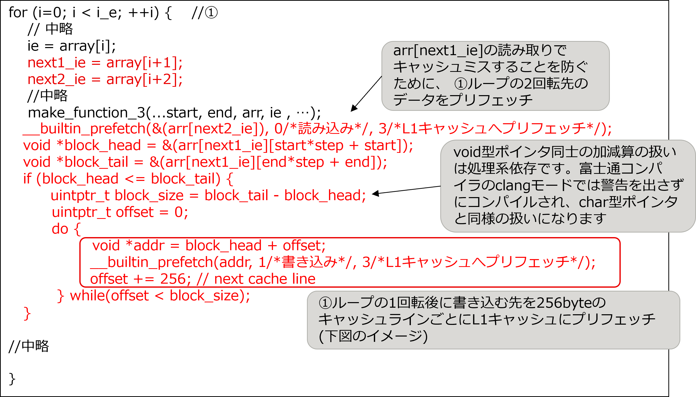
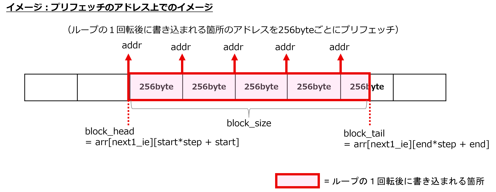
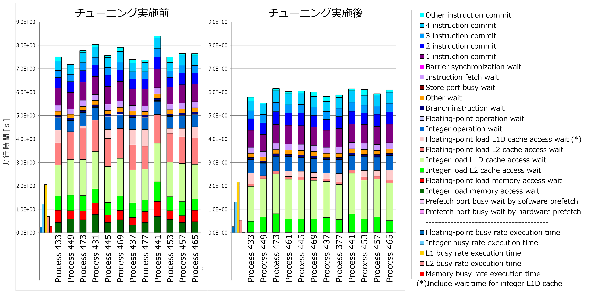

.. _4p6:

ビルトインプリフェッチ
----------------------

.. _チューニング対象-5:

チューニング対象
~~~~~~~~~~~~~~~~

本節で対象とした make_function_3 関数は、「システム方程式マトリクス構築」の計測区間に含まれ、チューニング実施前のアプリケーション全体の約1.7％のコストを占めている関数です。

本節のチューニングは make_function_2 関数、make_function_7 関数にも実施しましたが、分析内容やチューニング内容は make_function_3 関数に実施した内容と同様のため、本節では make_function_3 関数を例に説明します。

.. _分析-5:

分析
~~~~

make_function_3 関数を分析した結果、下記の①ループに着目しました。このループの特徴は以下の通りです。

-  詳細プロファイラでループを分析したところ、L1 と L2 のキャッシュ待ち時間が発生しています。（4.6.4項のチューニング実施前の結果を参照してください）

-  make_function_3 関数の配列 x が非連続なアクセスで、キャッシュミスを起こしていると考えられます。

[チューニング実施前の make_function_3 関数とその呼び出し元のソースコードの抜粋]

|image15|

.. _実施-5:

実施
~~~~

分析結果を踏まえて、以下のチューニングを実施しました。

-  L1 と L2 キャッシュのキャッシュ待ち時間短縮のため、make_function_3 関数の呼び出し元に、プリフェッチを行うビルトイン関数を追加し、利用するデータを予めキャッシュにプリフェッチしておきます。このビルトイン関数は、コンパイラがサポートする GNU C/C++ 拡張仕様の１つです。

[チューニング実施後の make_function_3 関数の呼び出し元のソースコードの抜粋]

|image16|

|image17|

.. _効果の検証-5:

効果の検証
~~~~~~~~~~

実施したチューニングを評価するために、詳細プロファイラで出力した、make_function_3 関数の Cycle Accounting（プログラムの実行時間の内訳）を、チューニング実施前後で比較しました。

|image18|

上記グラフのうち、チューニング実施前後の計測結果の中で最も実行時間が長い Process 441 に着目すると、実行時間は8.40秒から6.15秒に短縮し、約27％性能が改善しました。実行時間の内訳をみると「Floating-point load L2 cache access wait」「Floating-point load memory access wait」「Integer load memory access wait」が特に改善しており、これは本節のチューニングによるプリフェッチの効果と考えられます。

   

   