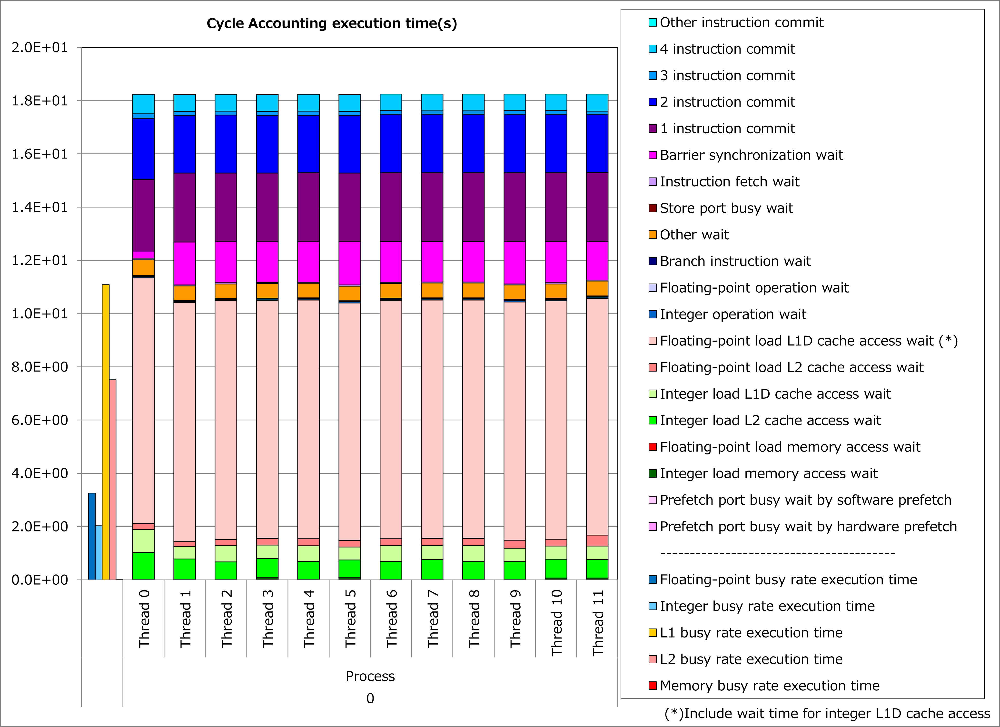
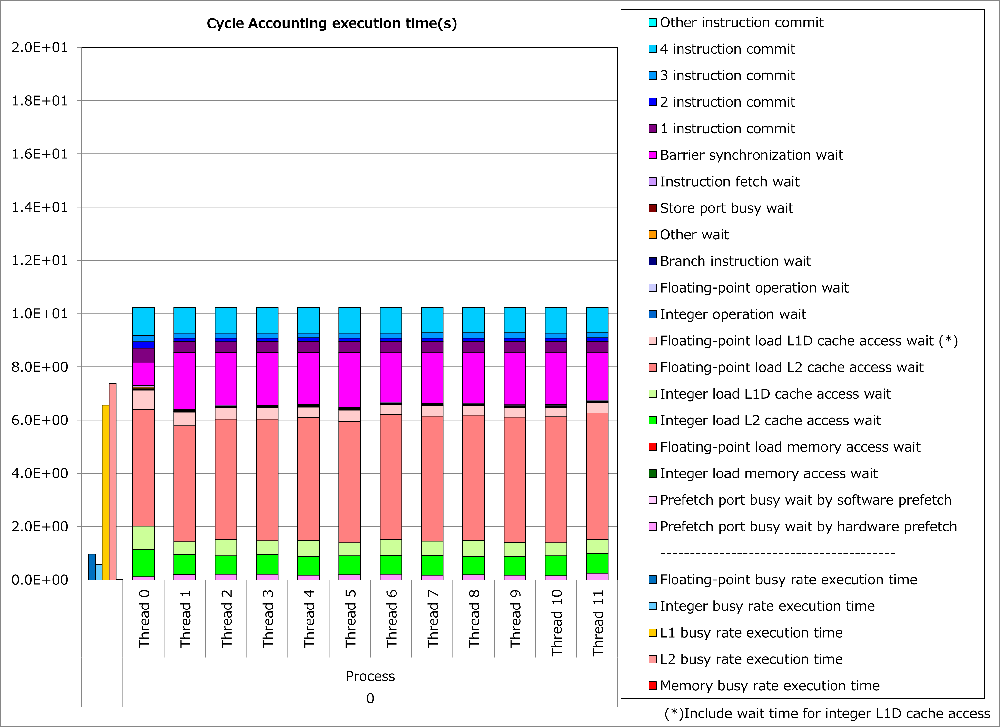

Specifying CONTIGUOUS Attribute to Array Pointer
------------------------------------------------

Motivation
^^^^^^^^^^

In Fortran programs, array pointers specified as CONTIGUOUS can be associated only with contiguous targets.
Therefore, when CONTIGUOUS attribute is specified to an array pointer, Fujitsu Fortran compiler optimizes object codes for array accesses under the assumption that the data pointed by the pointer is located contiguously in the memory.

It means that, when user can specify CONTIGUOUS attribute for an array pointer, array accesses are done with contiguous load/store instructions,
**busy time for cache access is reduced**
and it might lead to reduction of execution time.

Applied Example
^^^^^^^^^^^^^^^

Using an example based on
`STREAM benchmark <https://www.cs.virginia.edu/stream/FTP/Code/stream.f>`__,
performance improvement by applying this technique is shown below.
In this example, CONTIGUOUS attribute is specified for array pointers pa, pb and pc, which are associated with allocatable arrays.

.. code-block:: fortran
   :caption: Original

   TYPE dtype
     REAL(KIND=8), DIMENSION(:), ALLOCATABLE :: a, b, c
   END TYPE dtype

.. literalinclude:: ../triadt.case0.F90
   :language: fortran
   :lines: 5,7-16

.. literalinclude:: ../triadt.case1.F90
   :language: fortran
   :lines: 5,7-16
   :caption: Technique applied
   :emphasize-lines: 2

Results of cycle accounting for executions before/after applying the technique are shown in graphs below.
Assuming blocking for L2 cache, a parameter for the loop execution was chosen as follows:

  n = 196608

Comparing the right graph for the technique applied to the left graph for the original, busy time for L1D cache access was reduced by half, waiting time for L2 cache access became dominant and execution time was reduced by 44%.

Real Cases
^^^^^^^^^^

A real case related to this technique is presented in
`“Meetings for application code tuning on A64FX computer systems” <https://www.hpci-office.jp/en/events/symposia/meetings_A64FX>`__
as follows:

* `Optimization of GENESIS on Fugaku <https://www.hpci-office.jp/documents/meeting_A64FX/201223/20201223_Kobayashi_Tuning.pdf#page=14>`__

References
^^^^^^^^^^

* `Fortran Language Reference "2.88 CONTIGUOUS Statement" <https://www.fugaku.r-ccs.riken.jp/doc_root/en/manuals/tcsds-1.2.37/lang/Fortran/j2ul-2557-01enz0.pdf#page=167>`__
* `Programming Guide (Fortran) "contiguous Attribute" <https://www.fugaku.r-ccs.riken.jp/doc_root/en/programming_guides/Fortran_Programming_Guide.pdf#page=147>`__
* `Programming Guide (Fortran) "Performance Tuning by pointer" <https://www.fugaku.r-ccs.riken.jp/doc_root/en/programming_guides/Fortran_Programming_Guide.pdf#page=162>`__
* `Programming Guide (Tuning) "Loops Containing Pointer Variables (contiguous Attribute Specified)" <https://www.fugaku.r-ccs.riken.jp/doc_root/en/programming_guides/Tuning_Programming_Guide.pdf#page=176>`__
* `CPU performance tuning based on the type of application "5.4.7 supplement compiler optimization - adding contiguous attribute to array of pointers" <https://www.fugaku.r-ccs.riken.jp/doc_root/en/programming_guides/app-tuning-pattern-English.pdf#page=65>`__

Notice: Access rights for
`Fugaku User Portal <https://www.fugaku.r-ccs.riken.jp/en/>`__
are required to read the above documents.
