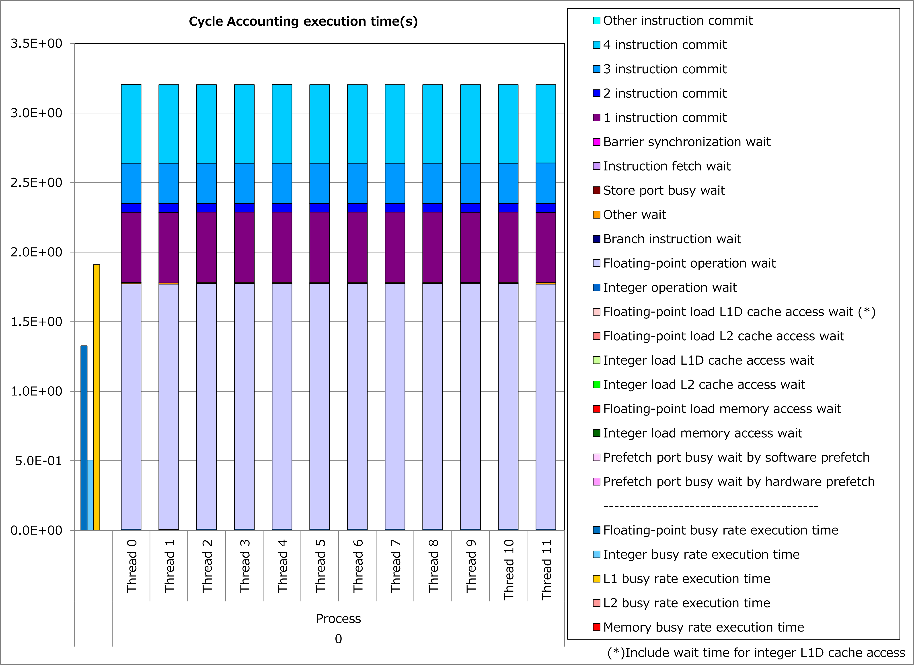

Interchange of Array Dimension for AoS Layout
---------------------------------------------

Motivation
^^^^^^^^^^

Array of Structures is a type of data layout, where structures (in C language) are allocated as an array, as shown in the example below.

.. code-block:: c
   :caption: Declaration of an AoS array (in C language)

   struct Particle {double x; double y; double z;};
   struct Particle particles[N];

.. figure:: ../cachewait-aos.png
   :scale: 20%

   Order of memory allocation for an AoS array

Similar data structure can be declared with a multi-dimension array as follows:

.. code-block:: fortran
   :caption: Declaration of an AoS-type 2D array (in Fortran)

   real, dimension(3,N) :: particles_aos

.. figure:: ../cachewait-2d-aos.png
   :scale: 20%

   Order of memory allocation for an AoS-type 2D array

For the above example, if N is much larger than 3, vectorizing a loop, whose do-variable corresponds to the array dimension of size N, is expected to promote compiler optimizations and show better execution performance as a result.
However, since the array dimension of size N is not the first dimension (for Fortran programs) of the array, as explained for
:doc:`the previous example <cachewait-unroll>`,
the array accesses become non-contiguous and lead to more busy time for cache access.

In such cases, interchanging the first and the second dimensions in this example realizes Structure of Arrays (SoA) layout shown below and
**reduces busy time for cache access when vectorizing the loop**
corresponding to the array dimension of size N.

.. code-block:: fortran
   :caption: Declaration of an SoA-type 2D array (in Fortran)

   real, dimension(N,3) :: particles_soa

.. figure:: ../cachewait-2d-soa.png
   :scale: 20%

   Order of memory allocation for an SoA-type 2D array

As a result, while compiler optimizations are promoted, busy time for cache access is also reduced and it might lead to reduction of execution time.

Applied Example
^^^^^^^^^^^^^^^

Referring to an example presented in
`“Meetings for application code tuning on A64FX computer systems” <https://www.hpci-office.jp/en/events/symposia/meetings_A64FX>`__,
performance improvement by applying this technique is shown below.
In this example, temporary arrays x, y, z and m were introduced to replace non-contiguous accesses to an AoS-type array “body” with their contiguous accesses in a loop for for-variable j.

.. literalinclude:: ../nbody.case0.cpp
   :language: c++
   :lines: 6-25
   :caption: Original

.. literalinclude:: ../nbody.case2.cpp
   :language: c++
   :lines: 6-33
   :caption: Technique applied
   :emphasize-lines: 1,3-8,13-15,20

Results of cycle accounting for executions before/after applying the technique are shown in graphs below.
A parameter for the loop execution is as follows:

  n = 2048

Comparing the right graph for the technique applied to the left graph for the original, busy time for L1D cache access was reduced dramatically and execution time was reduced by 34%.
In this example, an appearance of waiting time for floating-point calculation is considered to be due to many calculations chained after an array reference within a loop.

.. image:: ../nbody.29503716.2.png
   :width: 49%

Real Cases
^^^^^^^^^^

Real cases related to this technique are presented in
`“Meetings for application code tuning on A64FX computer systems” <https://www.hpci-office.jp/en/events/symposia/meetings_A64FX>`__
as follows:

* `Optimization of GENESIS on Fugaku <https://www.hpci-office.jp/documents/meeting_A64FX/201223/20201223_Kobayashi_Tuning.pdf#page=12>`__
* `Performance tuning of N-body kernel for A64FX processor <https://www.hpci-office.jp/documents/meeting_A64FX/220428/rist-a64fx-nbody.pdf#page=15>`__

References
^^^^^^^^^^

* `Programming Guide (Tuning) "Conditions for Applying the Multiple Structures Instruction" <https://www.fugaku.r-ccs.riken.jp/doc_root/en/programming_guides/Tuning_Programming_Guide.pdf#page=244>`__

Notice: Access rights for
`Fugaku User Portal <https://www.fugaku.r-ccs.riken.jp/en/>`__
are required to read the above documents.
