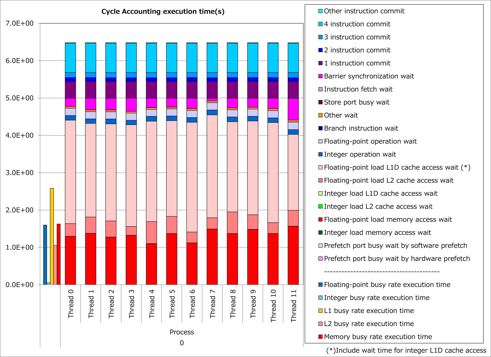
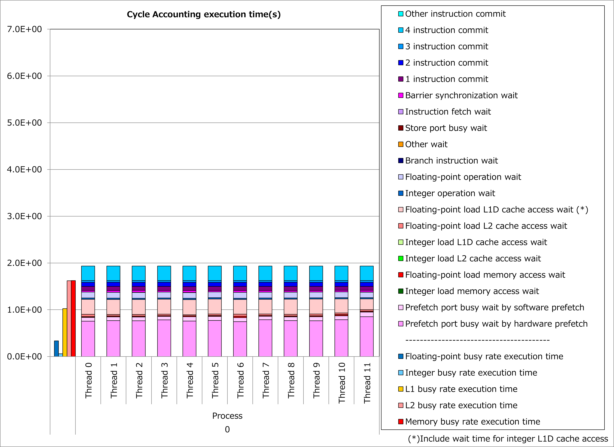

Full-Unrolling of Innermost Loop with Non-Contiguous Data Access
----------------------------------------------------------------

Motivation
^^^^^^^^^^

Fujitsu Fortran/C/C++ compilers vectorize innermost loops.
Therefore, if an index of the first dimension (for Fortran programs) for an array reference within an innermost loop is not the do-variable for the innermost loop, the array accesses are not contiguous and lead to more busy time for cache access.

However, when the iteration count for the innermost loop is constant and small, full-unrolling of the innermost loop might make
**the index of the first dimension for the array reference to be the do-variable for the vectorized loop**.

As a result, array accesses become contiguous, the busy time for cache access decreases and it might lead to reduction of execution time.

Applied Example
^^^^^^^^^^^^^^^

Referring to an example presented in
`“Meetings for application code tuning on A64FX computer systems” <https://www.hpci-office.jp/en/events/symposia/meetings_A64FX>`__,
performance improvement by applying this technique is shown below.
In this example, an OCL of “fullunroll_pre_simd” was added to a loop for do-variable IP, which has non-contiguous references to an array F.

.. literalinclude:: ../ffx.case0.F90
   :language: fortran
   :lines: 9-22
   :caption: Original

.. literalinclude:: ../ffx.case1.F90
   :language: fortran
   :lines: 10-24
   :caption: Technique applied
   :emphasize-lines: 7

Results of cycle accounting for executions before/after applying the technique are shown in graphs below.
A parameter for the loop execution is as follows:

  NG3 = 131 :sup:`3`

Comparing the right graph for the technique applied to the left graph for the original, busy time for L1D cache access was reduced by half, waiting time for L1D cache access dropped dramatically and execution time was reduced by 70%.

Real Cases
^^^^^^^^^^

Real cases related to this technique are presented in
`“Meetings for application code tuning on A64FX computer systems” <https://www.hpci-office.jp/en/events/symposia/meetings_A64FX>`__
as follows:

* `Performance tuning and analysis for the axhelm kernel in NeK5000/RS CFD codes <https://www.hpci-office.jp/documents/meeting_A64FX/220428/20220428_Performance_Tuning_on_Fugaku-tj-rev0.pdf#page=42>`__
* `Examples of serial-code optimization for A64FX processor cores <https://www.hpci-office.jp/documents/meeting_A64FX/220727/Examples_of_serial-code_opt_for_A64FX-RIST-20220725.pdf#page=14>`__

References
^^^^^^^^^^

* `Fortran User's Guide "9.1.1.4 Loop Unrolling" <https://www.fugaku.r-ccs.riken.jp/doc_root/en/manuals/tcsds-1.2.37/lang/Fortran/j2ul-2558-01enz0.pdf#page=258>`__
* `C User's Guide "3.2.4 Loop Unrolling" <https://www.fugaku.r-ccs.riken.jp/doc_root/en/manuals/tcsds-1.2.37/lang/C/j2ul-2560-01enz0.pdf#page=62>`__
* `C++ User's Guide "3.2.4 Loop Unrolling" <https://www.fugaku.r-ccs.riken.jp/doc_root/en/manuals/tcsds-1.2.37/lang/C++/j2ul-2561-01enz0.pdf#page=65>`__
* `Programming Guide (Fortran) "FULLUNROLL_PRE_SIMD" <https://www.fugaku.r-ccs.riken.jp/doc_root/en/programming_guides/Fortran_Programming_Guide.pdf#page=48>`__

Notice: Access rights for
`Fugaku User Portal <https://www.fugaku.r-ccs.riken.jp/en/>`__
are required to read the above documents.
