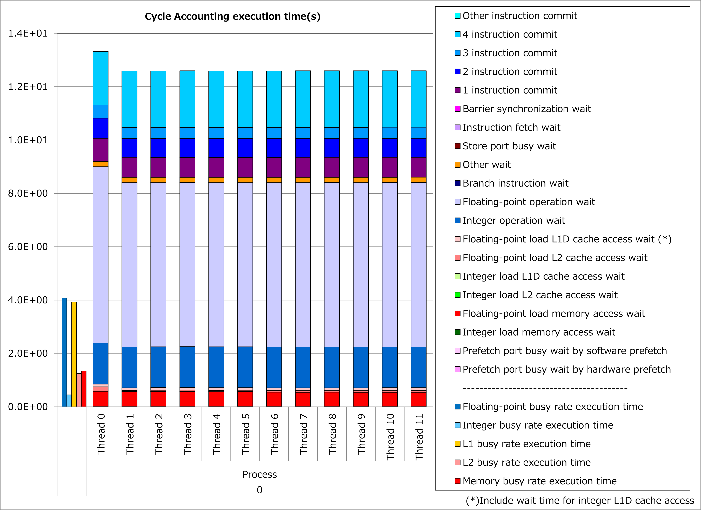

Fission of Imperfectly Nested Loops
-----------------------------------

Motivation
^^^^^^^^^^

Fujitsu Fortran/C/C++ compilers vectorize innermost loops.
Therefore, if nested loops are not perfectly nested, i.e. there is an executed statement outside the innermost loop, calculations outside the innermost loop are not vectorized and executed sequentially.

.. code-block:: fortran
   :caption: Perfectly nested loops

   DO j = 1, n
     DO i = 1, n
       y(j) = y(j) + a(i,j) * x(i)
     END DO
   END DO

.. code-block:: fortran
   :caption: Imperfectly nested loops
   :emphasize-lines: 5

   DO j = 1, n
     DO i = 1, n
       y(j) = y(j) + a(i,j) * x(i)
     END DO
     y(j) = y(j) / a(j,j)
   END DO

When ratio of calculations outside the innermost loop is not ignorable, fission of imperfectly nested loops, which makes multiple perfectly nested loops, might
**improve ratio of vectorized calculations**.

.. code-block:: fortran
   :caption: After loop fission
   :emphasize-lines: 5-6

   DO j = 1, n
     DO i = 1, n
       y(j) = y(j) + a(i,j) * x(i)
     END DO
   END DO
   DO j = 1, n
     y(j) = y(j) / a(j,j)
   END DO

As a result, more calculations are executed simultaneously and it might lead to reduction of execution time.

Applied Example
^^^^^^^^^^^^^^^

Referring to an example presented in
`“Meetings for application code tuning on A64FX computer systems” <https://www.hpci-office.jp/en/events/symposia/meetings_A64FX>`__,
performance improvement by applying this technique is shown below.
In this example, a loop for for-variable i, which is the outer loop for imperfectly nested loops, is distributed into a loop containing one for for-variable m and another for the remainder part.

.. literalinclude:: ../axhelm2.case0.c
   :language: c
   :lines: 8-32
   :caption: Original

.. literalinclude:: ../axhelm2.case1.c
   :language: c
   :lines: 8-39
   :caption: Technique applied
   :emphasize-lines: 16,18

Ratios of SIMD instructions and results of cycle accounting for executions before/after applying the technique are shown in graphs below.
A parameter for the loop execution is as follows:

  p_Nq = 8

Comparing the lower graph for the technique applied to the upper graph for the original, ratio of SIMD instructions was improved from 53% to 76% and execution time was reduced by 16%.

.. image:: ../axhelm2.29503716.0.simd.png
   :width: 15%
   :align: left

.. image:: ../axhelm2.29503716.1.simd.png
   :width: 15%
   :align: left

Real Cases
^^^^^^^^^^

A real case related to this technique is presented in
`“Meetings for application code tuning on A64FX computer systems” <https://www.hpci-office.jp/en/events/symposia/meetings_A64FX>`__
as follows:

* `Performance tuning and analysis for the axhelm kernel in NeK5000/RS CFD codes <https://www.hpci-office.jp/documents/meeting_A64FX/220428/20220428_Performance_Tuning_on_Fugaku-tj-rev0.pdf#page=16>`__

References
^^^^^^^^^^

* `Tuning document for Axhelm kernel - Alternative solution (tune-1a) <https://riken-rccs.github.io/axhelm-doc/en/build/html/tune-1a.html>`__
