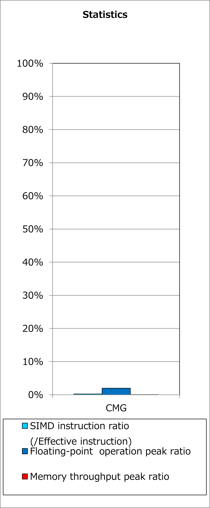
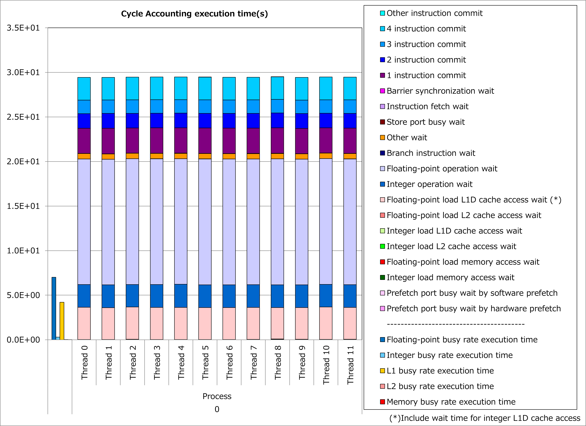
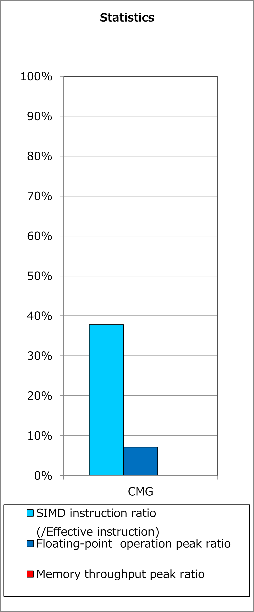
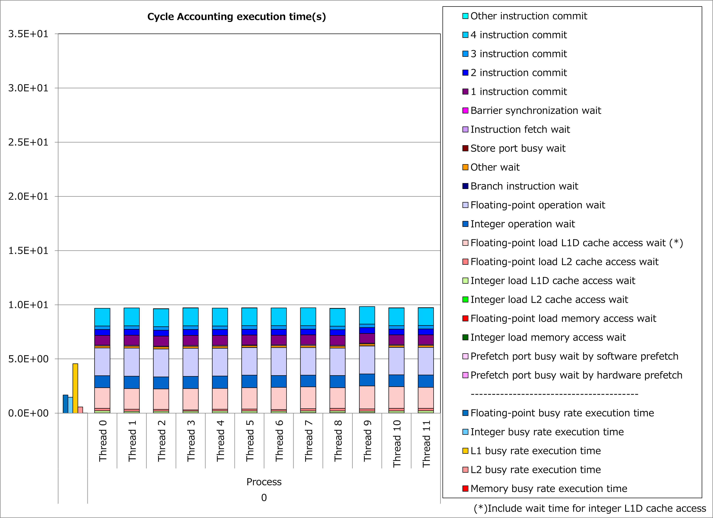

Interchange of Innermost Loop with Data Dependency
--------------------------------------------------

Motivation
^^^^^^^^^^

As the result of vectorization by compilers, calculations for different loop iterations are executed simultaneously.
Therefore, in cases that there is any data dependency between loop iterations, that loop can not be vectorized because the calculation results must be obtained as written in the source program.

.. code-block:: fortran
   :caption: Program without loop-carried data dependency

   DO i = 1, n
     x(i) = x(i) + 1
   END DO

.. code-block:: fortran
   :caption: Program with loop-carried data dependency
   :emphasize-lines: 2

   DO i = 1, n
     x(i) = x(i-1) + 1
   END DO

When there is no data dependency between loop iterations of an outer loop even if the innermost loop has data dependency, interchange of these loops makes it possible to
**vectorize the outer loop**.

As a result, simultaneous execution of calculations for different loop iterations might reduce execution time.

Applied Example
^^^^^^^^^^^^^^^

Referring to an example presented in
`“Meetings for application code tuning on A64FX computer systems” <https://www.hpci-office.jp/en/events/symposia/meetings_A64FX>`__,
performance improvement by applying this technique is shown below.
In this example, a loop for do-variable k, which has data dependency for arrays of R12pls, E12mns, R12mns and E12pls, is interchanged with loops for do-variable ich and icloud.

.. code-block:: fortran
   :caption: Original

     do ich = 1, chmax
        do icloud = 1, 2
           ic = (ich - 1) * MSTRN_ncloud + icloud
           ... 
           R(rd_kmax+1) = 0
           T(rd_kmax+1) = 0
           do k = rd_kmax, 1, -1
              R(k) = (cf(k)) * R0(k,I_Cloud,ich) &
                   + (1.0_RP - cf(k)) * R0(k,I_ClearSky,ich)
              T(k) = (cf(k)) * T0(k,I_Cloud,ich) &
                   + (1.0_RP - cf(k)) * T0(k,I_ClearSky,ich)
              R12pls(k,ic) = R(k) + T(k) / (1.0_RP - R12pls(k+1,ic) * R(k)) &
                   * (R12pls(k+1,ic) * T(k))
              E12mns(k,ic) = Em(k,ic) + T(k) / ( 1.0_RP - R12pls(k+1,ic) * R(k)) &
                   * (R12pls(k+1,ic) * Ep(k,ic) + E12mns(k+1,ic))
           end do
           do k = 2, rd_kmax+1
              R12mns(k,ic) = R(k) + T(k) / (1.0_RP - R12mns(k-1,ic) * R(k)) &
                   * (R12mns(k-1,ic) * T(k))
              E12pls(k,ic) = Ep(k,ic) + T(k) / (1.0_RP - R12mns(k-1,ic) * R(k)) &
                   * (R12mns(k-1,ic) * Em(k,ic) + E12pls(k-1,ic))
           end do
        end do
     end do

.. literalinclude:: ../twst.case1.F90
   :language: fortran
   :lines: 42-68
   :caption: Technique applied
   :emphasize-lines: 14-15

Ratios of SIMD instructions and results of cycle accounting for executions before/after applying the technique are shown in graphs below.
Parameters for the loop execution are as follows:

  rd_kmax = 54, chmax = 5, MSTRN_ncloud = 2

Comparing the lower graph for the technique applied to the upper graph for the original, ratio of SIMD instructions was improved from 0% to 38% and execution time was reduced by 67%.

Real Cases
^^^^^^^^^^

A real case related to this technique is presented in
`“Meetings for application code tuning on A64FX computer systems” <https://www.hpci-office.jp/en/events/symposia/meetings_A64FX>`__
as follows:

* `A64FX Tuning - SCALE on Fugaku - <https://www.hpci-office.jp/documents/meeting_A64FX/201209/20201209_A64FX-tuning_yamaura.pdf#page=9>`__
