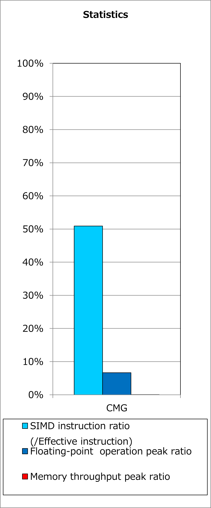
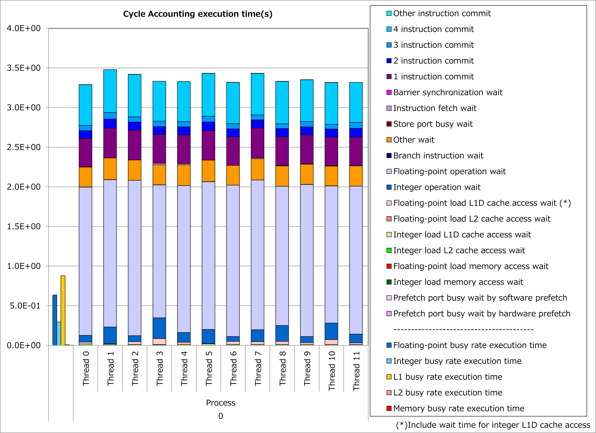
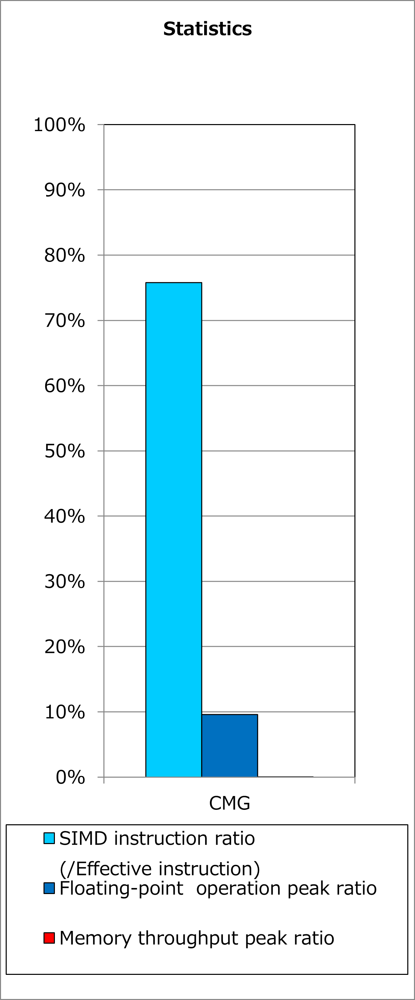
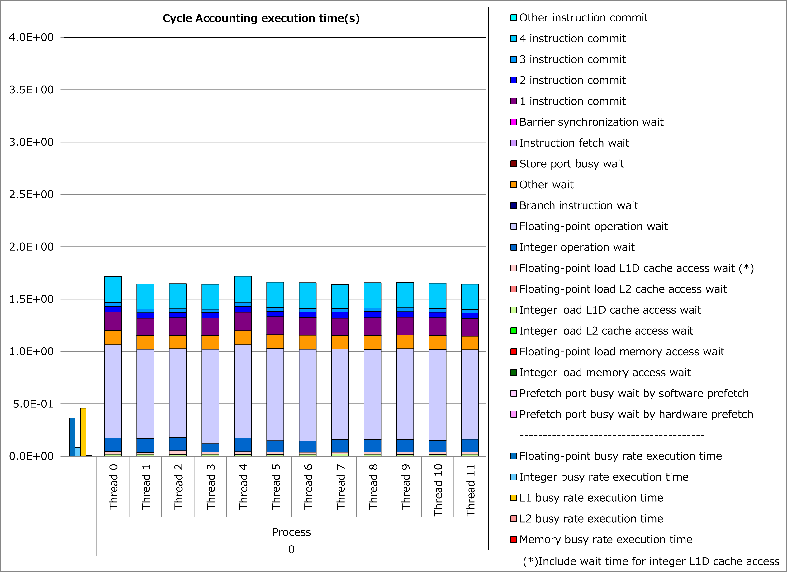

Interchange of Innermost Loop with Small Iteration Count
--------------------------------------------------------

Motivation
^^^^^^^^^^

Using predicate registers on A64FX processors, Fujitsu Fortran/C/C++ compilers can vectorizes loops with any iteration counts.
However, if an iteration count of a loop is small and not multiples of SIMD length, the number of calculations inactivated by predicate registers becomes unignorable ratio.

When the iteration count for the innermost loop is small but one for an outer loop is relatively large, interchange of these loops might
**reduce the ratio of calculations inactivated by predicate registers**.

As a result, reduction of inactivated calculations might reduce execution time.

Applied Example
^^^^^^^^^^^^^^^

Referring to an example presented in
`“Meetings for application code tuning on A64FX computer systems” <https://www.hpci-office.jp/en/events/symposia/meetings_A64FX>`__,
performance improvement by applying this technique is shown below.
In this example, a loop for do-variable ich, which has a small iteration count, is interchanged with a loop for do-variable k.

.. literalinclude:: ../dtrn3.case1.F90
   :language: fortran
   :lines: 16-29
   :caption: Original

.. literalinclude:: ../dtrn3.case2.F90
   :language: fortran
   :lines: 17-30
   :caption: Technique applied
   :emphasize-lines: 1-2

Ratios of SIMD instructions and results of cycle accounting for executions before/after applying the technique are shown in graphs below.
Parameters for the loop execution are as follows:

  rd_kmax = 54, chmax = 5

Comparing the lower graph for the technique applied to the upper graph for the original, execution time was reduced by 51%.
At the time, the number of executed instructions for floating-point calculations was reduced by 35% and ratio of active elements in floating-point calculation pipelines was improved from 68% to 86%.

Real Cases
^^^^^^^^^^

A real case related to this technique is presented in
`“Meetings for application code tuning on A64FX computer systems” <https://www.hpci-office.jp/en/events/symposia/meetings_A64FX>`__
as follows:

* `A64FX Tuning - SCALE on Fugaku - <https://www.hpci-office.jp/documents/meeting_A64FX/201209/20201209_A64FX-tuning_yamaura.pdf#page=13>`__
