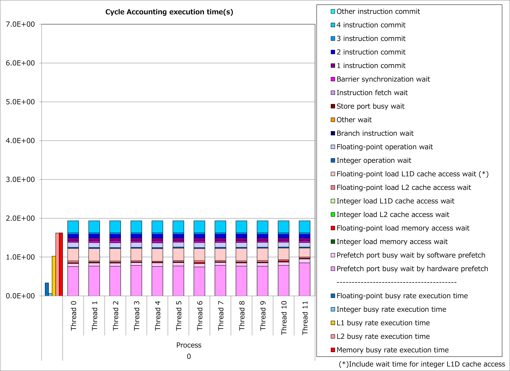

非連続アクセス最内ループのフルアンローリング
--------------------------------------------

動機
^^^^

富士通Fortran/C/C++コンパイラは最内ループをSIMD化します。
そのため、ループ内の配列アクセスにおいて1次元目(Fortran言語の場合)が最内ループのループ変数でない場合、配列アクセスが非連続的になり、プロセッサのキャッシュアクセス負荷が高くなります。

ここで、最内ループの繰り返し数が一定かつ少ない場合、当該ループをフルアンローリングすることによって、
**SIMD化されるループのループ変数を配列アクセスの1次元目**
にできるケースがあります。

その結果、配列アクセスが連続的になり、プロセッサのキャッシュアクセス負荷が軽減されて、実行時間を短縮できる可能性があります。

適用例
^^^^^^

`A64FX向けチューニング技術検討会 <https://www.hpci-office.jp/en/events/symposia/meetings_A64FX>`__
で示されたコード例を用いて、性能改善の例を以下に示します。
この例では、配列Fのアクセスが非連続的であるdo変数IPのループに対して、fullunroll_pre_simdの最適化制御行を適用しています。

.. literalinclude:: ../ffx.case0.F90
   :language: fortran
   :lines: 9-22
   :caption: 改善前

.. literalinclude:: ../ffx.case1.F90
   :language: fortran
   :lines: 10-24
   :caption: 改善後
   :emphasize-lines: 7

改善前および改善後コードのサイクルアカウンティング測定結果を下記グラフに示します。
なお、性能測定条件は以下のとおりです。

  NG3 = 131 :sup:`3`

改善前(左のグラフ)に対して改善後(右のグラフ)の測定結果では、L1Dキャッシュビジー時間が半減、L1Dキャッシュアクセス待ち時間が激減し、実行時間が70%減ったことが分かります。

.. image:: ../ffx.29503716.0.png
   :width: 49%

実例
^^^^

`A64FX向けチューニング技術検討会 <https://www.hpci-office.jp/en/events/symposia/meetings_A64FX>`__
にて、この種の事例が以下のとおり紹介されています。

* `Performance tuning and analysis for the axhelm kernel in NeK5000/RS CFD codes <https://www.hpci-office.jp/documents/meeting_A64FX/220428/20220428_Performance_Tuning_on_Fugaku-tj-rev0.pdf#page=42>`__
* `Examples of serial-code optimization for A64FX processor cores <https://www.hpci-office.jp/documents/meeting_A64FX/220727/Examples_of_serial-code_opt_for_A64FX-RIST-20220725.pdf#page=14>`__

参考資料
^^^^^^^^

* `Fortran使用手引書 "9.1.1.4 ループアンローリング" <https://www.fugaku.r-ccs.riken.jp/doc_root/ja/manuals/tcsds-1.2.37/lang/Fortran/j2ul-2558-01z0.pdf#page=257>`__
* `C言語使用手引書 "3.2.4 ループアンローリング" <https://www.fugaku.r-ccs.riken.jp/doc_root/ja/manuals/tcsds-1.2.37/lang/C/j2ul-2560-01z0.pdf#page=62>`__
* `C++言語使用手引書 "3.2.4 ループアンローリング" <https://www.fugaku.r-ccs.riken.jp/doc_root/ja/manuals/tcsds-1.2.37/lang/C++/j2ul-2561-01z0.pdf#page=65>`__
* `プログラミングガイド Fortran編 "FULLUNROLL_PRE_SIMD" <https://www.fugaku.r-ccs.riken.jp/doc_root/ja/programming_guides/Fortran_Programming_Guide_JA.pdf#page=48>`__

注意: 上記ドキュメントの参照には
`スーパーコンピュータ「富岳」利用者ポータル <https://www.fugaku.r-ccs.riken.jp/>`__
のアクセス権が必要です。
