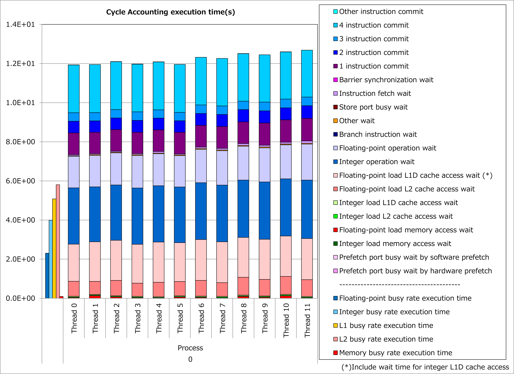
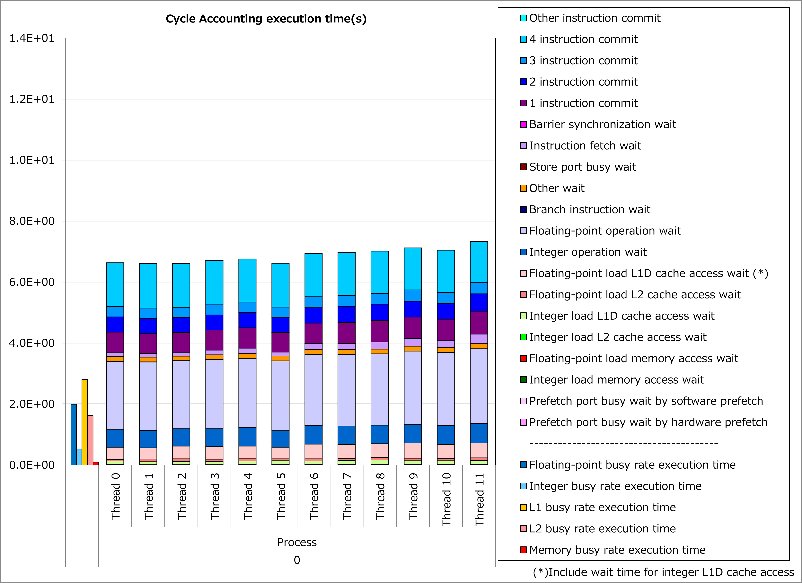

巨大ループのループ分割
----------------------

動機
^^^^

富士通Fortran/C/C++コンパイラはA64FXプロセッサの性能を引き出すために、ソフトウェアパイプライニングの最適化を活用します。
ただし、ソフトウェアパイプライニングはA64FXプロセッサの各種レジスタを通常よりも多く使用するため、対象ループのループボディが大きい場合、レジスタ不足によって本最適化を適用できない場合があります。

そこで、ソースプログラムにloop_fission_targetの最適化制御行(OCL)を挿入することによって、
**巨大なループの自動分割をコンパイラに指示**
できるケースがあります。

その結果、ソースプログラム上では大きなループが複数の小さなループとしてコンパイラで扱われることにより、ソフトウェアパイプライニングやレジスタ割り当ての最適化が促進されて、実行時間を短縮できる可能性があります。

適用例
^^^^^^

`A64FX向けチューニング技術検討会 <https://www.hpci-office.jp/en/events/symposia/meetings_A64FX>`__
で示されたコード例を用いて、性能改善の例を以下に示します。
この例では、ループボディが大きいdo変数iiのループに対して、loop_fission_targetの最適化制御行を適用しています。

.. literalinclude:: ../elecur.case0.F90
   :language: fortran
   :lines: 16-102
   :caption: 改善前

.. code-block:: fortran
   :caption: 改善後
   :emphasize-lines: 1

   !OCL LOOP_FISSION_TARGET(LS)
     do ii=cumcnt(i,j,k,isp)+1,cumcnt(i+1,j,k,isp)
        ...
     enddo

改善前および改善後コードのサイクルアカウンティング測定結果を下記グラフに示します。
なお、性能測定条件は以下のとおりです。

  cumcnt(i+1,j,k,isp) - cumcnt(i,j,k,isp) = 20

改善前(左のグラフ)に対して改善後(右のグラフ)の測定結果では、整数演算ビジー時間や整数演算待ち時間が大幅減少し、実行時間が44%減ったことが分かります。
なおL1Dキャッシュビジー時間やL1Dキャッシュアクセス待ち時間の減少は、ループ分割によってプロセッサのレジスタスピル/フィル動作が減った効果と考えられます。

実例
^^^^

`A64FX向けチューニング技術検討会 <https://www.hpci-office.jp/en/events/symposia/meetings_A64FX>`__
にて、この種の事例が以下のとおり紹介されています。

* `LQCD tuning on Fugaku <https://www.hpci-office.jp/documents/meeting_A64FX/201223/LQCD_A64FX_20201223.pdf#page=17>`__
* `Performance tuning on LAMMPS for A64FX system <https://www.hpci-office.jp/documents/meeting_A64FX/210427/lmp_tune_for_a64fx_27Apr2021_final.pdf#page=20>`__
* `CPU and Thread Parallelization Tuning of FFVHC-ACE on Fugaku <https://www.hpci-office.jp/documents/meeting_A64FX/210427/Tuning_of_FFVHC-ACE.pdf#page=15>`__
* `Examples of serial-code optimization for A64FX processor cores <https://www.hpci-office.jp/documents/meeting_A64FX/220727/Examples_of_serial-code_opt_for_A64FX-RIST-20220725.pdf#page=8>`__

参考資料
^^^^^^^^

* `Fortran使用手引書 "9.1.2.11 ループ分割" <https://www.fugaku.r-ccs.riken.jp/doc_root/ja/manuals/tcsds-1.2.37/lang/Fortran/j2ul-2558-01z0.pdf#page=269>`__
* `C言語使用手引書 "3.3.10 ループ分割" <https://www.fugaku.r-ccs.riken.jp/doc_root/ja/manuals/tcsds-1.2.37/lang/C/j2ul-2560-01z0.pdf#page=77>`__
* `C++言語使用手引書 "3.3.10 ループ分割" <https://www.fugaku.r-ccs.riken.jp/doc_root/ja/manuals/tcsds-1.2.37/lang/C++/j2ul-2561-01z0.pdf#page=80>`__
* `プログラミングガイド Fortran編 "LOOP_FISSION" <https://www.fugaku.r-ccs.riken.jp/doc_root/ja/programming_guides/Fortran_Programming_Guide_JA.pdf#page=54>`__
* `アプリケーションのタイプ別CPU性能チューニング "5.2 タイプ毎のチューニング技術(1)" <https://www.fugaku.r-ccs.riken.jp/doc_root/ja/programming_guides/app-tuning-pattern-Nihongo.pdf#page=23>`__

注意: 上記ドキュメントの参照には
`スーパーコンピュータ「富岳」利用者ポータル <https://www.fugaku.r-ccs.riken.jp/>`__
のアクセス権が必要です。
